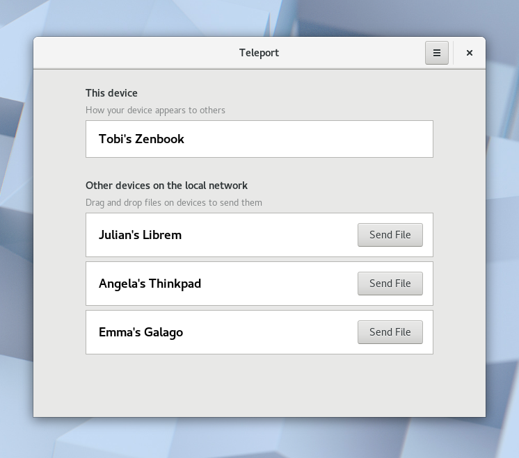
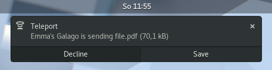

# Teleport
Teleport is a native GTK3 app to effortlessly share files on the local network.



Have you ever asked yourself why the easiest way to move a file between two computers in the same room involves sending it to a server in another country?

Teleport is designed to be a replacement for using USB keys or emailing stuff to yourself just so you have them on another device on your desk. The main user interface on the receiver's side are notifications:



## Install
Teleport is currently in early development, but you can try it by installing it
via GNOME Software or via [flatpak](http://flatpak.org).
```
flatpak install flathub com.frac_tion.teleport
```

## Roadmap
It's still early days, but we have exciting plans for the future. While Teleport can currently only send individual files, longer term we are interested in doing things like:
* sending multiple files and folders
* sending text snippets
* file transfer progress bars
* encryption in transit
* native Android/iOS/macOS/Windows apps

## Build
#### Archlinux
```
  pacman -S base-devel libsoup avahi gtk3 meson
  git clone https://gitlab.gnome.org/jsparber/teleport
  cd teleport
  ./configure
  sudo make install
  teleport # or ./_build/src/teleport
```
#### Ubuntu
```
  apt install pkg-config libsoup2.4-dev libavahi-client3 libavahi-client-dev libgtk-3-dev meson
  git clone https://gitlab.gnome.org/jsparber/teleport
  cd teleport
  ./configure
  make
  sudo make install
  teleport # or ./_build/src/teleport
```


## License
AGPLv3, because freeeeeeedom
