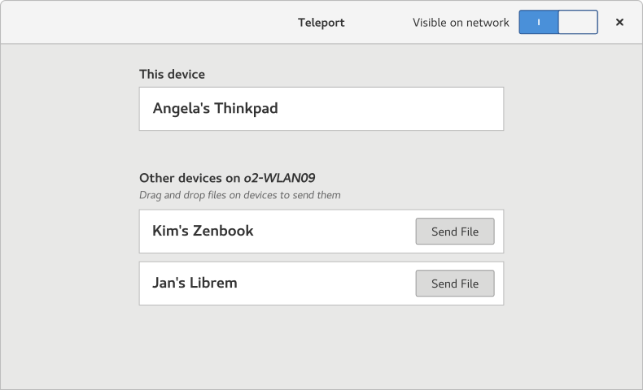
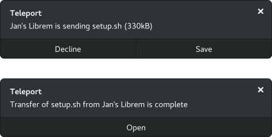

# Teleport
Teleport is a native GTK3 app to effortlessly share files on the local network.



It's our answer to the question

> Why is the easiest way to move a file between two computers in the same room sending it to a server in another country and retrieving it from there?

Teleport is designed to be a replacement for using USB keys or emailing stuff to yourself just so you have them on another device on your desk. The main user interface on the receiver's side are notifications:



## Roadmap
We are currently working on an MVP for a native GNOME app that only sends files, but longer term we are interested in doing things like:
* drag & drop files to send them
* sending text snippets
* file transfer progress bars
* settings dialog
* file encryption
* native Android/iOS/macOS/Windows apps

## Build
#### Archlinux
```
  pacman -S base-devel libsoup avahi gtk3 meson
  git clone https://github.com/frac-tion/teleport.git
  cd teleport
  ./configure
  make
  ./_build/src/teleport
```
#### Ubuntu
```
  apt install pkg-config libsoup2.4-dev libavahi-client3 libgtk-3-dev meson
  git clone https://github.com/frac-tion/teleport.git
  cd teleport
  ./configure
  make
  ./_build/src/teleport
```


## License
AGPLv3, because freeeeeeedom
